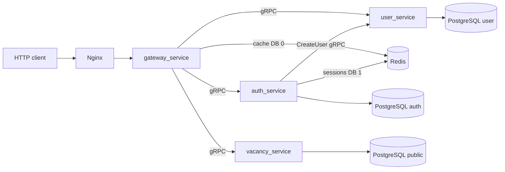

# Job Aggregator

Микросервисный backend агрегатора вакансий. Внешний клиент работает только с
HTTP API в `gateway_service`; остальные сервисы общаются по unary gRPC.

## Текущее состояние

Реализованы:

- регистрация и вход по email или телефону;
- RS256 access JWT, refresh JWT, Redis-сессии, rotation и logout;
- локальная проверка access JWT в Gateway через Passport JWT;
- профиль соискателя, контакты, образование и опыт работы;
- создание, изменение, публикация и удаление резюме;
- создание, пакетная загрузка, получение и фильтрация вакансий;
- Redis-кэш вакансий, профилей и резюме на уровне Gateway;
- Swagger, Postman-коллекции и HTTP smoke-тест;
- Prisma-миграции и справочники `user_service`;
- development и production Docker Compose.

Пока не реализованы:

- подтверждение email/телефона и SMTP — таблица `auth.email_codes` существует,
  но регистрация её пока не использует;
- OAuth — модель внешних identity подготовлена, самого flow ещё нет;
- `parser_service`;
- Kafka/outbox;
- отдельный migration tool для схемы `vacancy_service`.

## Сервисы и ответственность

| Компонент | Ответственность | Внешний транспорт |
| --- | --- | --- |
| `nginx` | единая точка входа и reverse proxy | HTTP :80 |
| `gateway_service` | публичные маршруты, Swagger, HTTP DTO, Passport JWT, кэш и вызовы внутренних сервисов | HTTP :3000 |
| `auth_service` | identity, password/OAuth credentials, роли, JWT и refresh-сессии | gRPC :5005 |
| `user_service` | пользователь, контакты, профиль, образование, опыт и резюме | gRPC :5000 |
| `vacancy_service` | хранение, upsert, чтение и поиск вакансий | gRPC :50051 |
| PostgreSQL | отдельные схемы `public`, `auth` и `user` | :5432 внутри Compose |
| Redis | Gateway-кэш в DB 0 и auth-сессии в DB 1 | :6379 внутри Compose |



### Регистрация

Регистрация требует пароль, имя, фамилию и ровно один идентификатор: email либо
телефон в E.164. `auth_service` создаёт `PENDING` identity, синхронно и
идемпотентно вызывает `user_service/CreateUser`, после чего активирует identity
и создаёт refresh-сессию в Redis. `CreateUser` сразу создаёт минимальный профиль
и начальный контакт.

Это межсервисный flow без распределённой транзакции: `PENDING` и идемпотентный
повтор закрывают незавершённую регистрацию.

### Проверка access JWT

Gateway проверяет подпись, срок, issuer, audience и payload access-токена
локально через `passport-jwt`. Поэтому обычный защищённый HTTP-запрос не делает
дополнительный вызов в `auth_service`. Внутренний RPC `ValidateAccessToken`
остаётся для операций, которым в будущем потребуется актуальная проверка
сессии, статуса identity или ролей.

## Архитектура кода

NestJS-сервисы организованы по бизнес-модулям. Внутри модуля контроллер является
transport-адаптером, сервис содержит сценарии использования, repository работает
с Prisma, а mapper преобразует транспортные и persistence-модели. Общие фильтры,
gRPC proxy, ошибки и инфраструктура находятся в `src/common`.

`vacancy_service` использует прагматичную Clean Architecture:

```text
cmd/api
  └── internal/app                  composition root и lifecycle

internal/handler/grpc               входной gRPC-адаптер
            ↓
internal/service/VacancyService     use-case методы
            ↓
internal/repository                 VacancyRepository port
            ↑
internal/repository/postgres        PostgreSQL/pgx/sqlc adapter

internal/domain                     Vacancy, Company, бизнес-типы и ошибки
```

В Go-сервисе use-case-методы намеренно находятся в одном читаемом
`vacancy_service.go`, а не разнесены по одному файлу на метод.

## Структура репозитория

```text
.
├── contracts/              исходные versioned protobuf-контракты
├── gateway_service/        публичный NestJS HTTP API
├── auth_service/           NestJS gRPC auth и сессии
├── user_service/           NestJS gRPC user/profile/resume
├── vacancy_service/        Go gRPC vacancy service
├── parser_service/         зарезервирован, пока не реализован
├── nginx/                  reverse proxy
├── redis/                  конфигурация Redis
├── postman/                коллекции, environments и flows
├── scripts/                smoke/benchmark scripts
├── docker-compose.yml      общая Compose-конфигурация
├── docker-compose.override.yml development override по умолчанию
├── docker-compose.prod.yml production override
├── Makefile                команды проекта
└── AGENTS.md               архитектурные правила для дальнейшей разработки
```

## Быстрый запуск

Требуются Docker Engine или Docker Desktop с Compose v2. GNU Make удобен, но не
обязателен.

Создайте локальный env-файл:

```bash
cp .env.example .env
```

Затем запустите весь development stack:

```bash
make dev
```

Для запуска в фоне:

```bash
make up-build
make ps
make health
```

Адреса development-окружения:

- API через Nginx: `http://localhost`;
- Swagger: `http://localhost/api-docs`;
- Gateway напрямую: `http://localhost:3000`;
- PostgreSQL: `localhost:5425`;
- Redis: `localhost:6379`;
- внутренние gRPC-порты на host: Vacancy `50051`, Auth `5005`, User `5000`.

В production наружу публикуется только Nginx.

### Dockerfile и выбор среды

У каждого реализованного микросервиса один многостадийный `Dockerfile`.
Compose выбирает стадию сборки через `build.target`:

- `docker-compose.yml` содержит общие настройки сервисов;
- `docker-compose.override.yml` автоматически добавляет `development`: исходники,
  локальные порты и запуск NestJS в watch-режиме или Go через `go run`;
- `docker-compose.prod.yml` добавляет `production`: обязательные secrets,
  защитные настройки и собранные runtime-образы без devDependencies у NestJS
  и без Go toolchain у Vacancy.

Общие шаги установки зависимостей и копирования исходников находятся в стадии
`base`; стадия `builder` компилирует приложение для production.
`NODE_ENV` задаёт режим Node.js во время выполнения, а `build.target` выбирает
состав образа во время сборки.

Обычная команда Compose автоматически объединяет базу с dev override. Для
production файлы указываются явно, поэтому dev-настройки туда не попадают:

```bash
docker compose up --build
docker compose -f docker-compose.yml -f docker-compose.prod.yml up --build -d
```

Эквивалентные команды Make: `make dev` и `make prod-build`.
При прямом `docker build` без `--target` собирается последняя стадия — `production`.

## Публичный HTTP API

Swagger по адресу `/api-docs` является подробным источником DTO и enum-значений.

### Системные и auth-маршруты

| Метод | Маршрут | Авторизация | Назначение |
| --- | --- | --- | --- |
| `GET` | `/health` | нет | health Gateway |
| `POST` | `/api/v1/auth/register` | нет | регистрация |
| `POST` | `/api/v1/auth/login` | нет | вход |
| `POST` | `/api/v1/auth/refresh` | нет | rotation refresh-токена |
| `POST` | `/api/v1/auth/logout` | нет | отзыв refresh-сессии |
| `GET` | `/api/v1/auth/me` | Bearer access JWT | текущий principal из access JWT |

Регистрация по email:

```bash
curl -X POST http://localhost/api/v1/auth/register \
  -H 'Content-Type: application/json' \
  -d '{
    "email": "ivan@example.com",
    "password": "strong-password-123",
    "first_name": "Иван",
    "last_name": "Петров"
  }'
```

Для регистрации по телефону передайте `phone_number` вместо `email`:

```json
{
  "phone_number": "+79991234567",
  "password": "strong-password-123",
  "first_name": "Иван",
  "last_name": "Петров"
}
```

Login использует единое поле `identifier`:

```json
{
  "identifier": "ivan@example.com",
  "password": "strong-password-123"
}
```

### Vacancy-маршруты

| Метод | Маршрут | Назначение |
| --- | --- | --- |
| `GET` | `/api/v1/vacancies` | список и фильтрация |
| `GET` | `/api/v1/vacancies/filter` | совместимый alias списка с фильтрами |
| `GET` | `/api/v1/vacancies/:id` | вакансия по ID |
| `POST` | `/api/v1/vacancies` | создать или обновить по уникальной ссылке |
| `POST` | `/api/v1/vacancies/batch` | пакетный upsert до 1000 вакансий |

Сейчас эти маршруты не защищены JWT, включая запись.

Пример создания:

```bash
curl -X POST http://localhost/api/v1/vacancies \
  -H 'Content-Type: application/json' \
  -d '{
    "title": "Go developer",
    "description": "Разработка backend-сервисов",
    "salary": 180000,
    "link": "https://example.com/vacancies/42",
    "city": "Moscow",
    "company_name": "Example"
  }'
```

Batch endpoint принимает только JSON-массив, а не объект `{ "vacancies": [] }`:

```json
[
  {
    "title": "Go developer",
    "description": "Backend",
    "salary": 180000,
    "link": "https://example.com/vacancies/42",
    "city": "Moscow",
    "company_name": "Example"
  }
]
```

Параметры списка:

| Параметр | Значение |
| --- | --- |
| `page` | страница от 1, по умолчанию 1 |
| `items_per_page` | от 1 до 100, по умолчанию 10 |
| `q` | поисковая строка до 200 символов |
| `search_field` | `title`, `description`, `company_name`; можно повторять или разделять запятыми |
| `city` | можно повторять или разделять запятыми |
| `min_salary`, `max_salary` | неотрицательные числа |
| `sort` | `date_desc`, `date_asc`, `salary_desc`, `salary_asc` |
| `period` | `day`, `3_days`, `week` |

Пример:

```text
GET /api/v1/vacancies?q=Go&search_field=title&city=Moscow&min_salary=100000&sort=salary_desc&period=week&page=1&items_per_page=20
```

### User/profile/resume-маршруты

Все маршруты ниже требуют `Authorization: Bearer <access_token>`.

| Метод | Маршрут | Назначение |
| --- | --- | --- |
| `GET` | `/api/v1/users/me/profile` | профиль текущего пользователя |
| `PUT` | `/api/v1/users/me/profile` | полная запись профиля, контактов, языков и гражданств |
| `POST` | `/api/v1/users/me/educations` | добавить образование |
| `PUT` | `/api/v1/users/me/educations/:educationId` | заменить образование |
| `DELETE` | `/api/v1/users/me/educations/:educationId` | удалить образование |
| `POST` | `/api/v1/users/me/work-experiences` | добавить опыт |
| `PUT` | `/api/v1/users/me/work-experiences/:workExperienceId` | заменить опыт |
| `DELETE` | `/api/v1/users/me/work-experiences/:workExperienceId` | удалить опыт |
| `POST` | `/api/v1/users/me/resumes` | создать резюме |
| `GET` | `/api/v1/users/me/resumes` | список своих резюме |
| `GET` | `/api/v1/users/me/resumes/:resumeId` | получить своё резюме |
| `PUT` | `/api/v1/users/me/resumes/:resumeId` | заменить резюме |
| `PATCH` | `/api/v1/users/me/resumes/:resumeId/status` | изменить статус публикации |
| `DELETE` | `/api/v1/users/me/resumes/:resumeId` | удалить резюме |

HTTP DTO используют `snake_case`. Конкретные значения protobuf enum удобнее
смотреть в Swagger или в `contracts/user/v1/user.proto`.

## Конфигурация

Полный список и development-значения находятся в `.env.example`. Основные
группы переменных:

- PostgreSQL: `POSTGRES_*`, `DATABASE_URL`, `AUTH_DATABASE_URL`, `USER_DATABASE_URL`;
- Redis: `REDIS_*`, `AUTH_SESSION_NAMESPACE`, `CACHE_*`;
- gRPC: `VACANCY_GRPC_*`, `AUTH_GRPC_*`, `USER_GRPC_*`;
- JWT: `JWT_ACCESS_PRIVATE_KEY_BASE64`, `JWT_ACCESS_PUBLIC_KEY_BASE64`,
  `JWT_REFRESH_SECRET`, TTL, issuer и audience;
- HTTP/logging: `NGINX_PORT`, `GATEWAY_PORT`, `LOG_LEVEL`, `LOG_DIR`.

Development использует встроенную тестовую RSA-пару, если ключи не переданы.
Production Compose требует собственные согласованные PKCS#8 private и SPKI public
RSA-ключи в base64, отдельный refresh secret и явные database URLs.

## Команды разработки

```bash
make help              # список основных команд
make config            # проверить development Compose
make dev               # build и запуск с логами
make up-build           # build и запуск в фоне
make down               # удалить контейнеры, сохранить PostgreSQL volume
make down-volumes       # удалить контейнеры и данные PostgreSQL
make logs               # логи всех контейнеров
make health             # Redis, Gateway, Nginx и Vacancy healthchecks
```

Проверки исходников:

```bash
make test               # тесты всех реализованных сервисов
make check              # format check, lint/test/build по сервисам
make vacancy-check
make gateway-check
make auth-check
make user-check
```

## Контракты и генерация

Исходниками являются только файлы в `contracts/*/v1/*.proto`. Сгенерированные
файлы в `src/generated` и `vacancy_service/internal/proto` вручную не изменяются.

```bash
make proto-tools
make proto-generate
```

После изменения SQL vacancy-сервиса:

```bash
make sqlc-install
make sqlc-vet
make sqlc-generate
```

## База данных и миграции

- `auth_service` и `user_service` используют Prisma migrations;
- development/production контейнеры выполняют `prisma migrate deploy` перед запуском;
- Prisma-модели используют camelCase в TypeScript и `@map`/`@@map` для
  snake_case имён PostgreSQL;
- `vacancy_service` пока выполняет встроенный идемпотентный `schema.sql` при
  старте; сложные изменения этой схемы требуют будущего migration tool.

Не изменяйте уже применённые Prisma-миграции. Для изменения схемы создавайте
новую миграцию и проверяйте `prisma validate`, генерацию клиента и сборку.

## Postman и smoke-тест

- инструкция: `postman/README.md`;
- основная коллекция: `postman/job-aggregator.postman_collection.json`;
- environments: `postman/environments`;
- Flow blueprint: `postman/flows`.

Автоматический smoke-тест:

```bash
node scripts/http-smoke.mjs
```

Настройка нагрузки:

```bash
BASE_URL=http://127.0.0.1:3000 \
BENCHMARK_REQUESTS=100 \
BENCHMARK_CONCURRENCY=10 \
node scripts/http-smoke.mjs
```

## Production

Перед запуском заполните обязательные production secrets и URLs в `.env`:

```bash
make prod-config
make prod-build
make prod-ps
```

Прикладные production-контейнеры, Redis и Nginx запускаются с read-only
filesystem, tmpfs для временных файлов, `no-new-privileges` и ограниченной
ротацией Docker-логов. PostgreSQL использует постоянный volume. Для публичного
окружения поверх текущего Nginx необходимо настроить TLS/HTTPS.
