# Job Aggregator happy-path Flow

Postman Flow должен создаваться **после** импорта
`postman/job-aggregator.postman_collection.json`, потому что HTTP Request blocks
ссылаются на внутренние request ID конкретного Postman workspace. Эти ID не
являются стабильной частью экспортированной Collection v2.1.

## Сценарий

```mermaid
flowchart LR
  start([Start]) --> health[Health]
  health --> register[Register]
  register --> login[Login]
  login --> refresh[Refresh token]
  refresh --> me[Current principal]
  me --> profile[Upsert profile]
  profile --> education[Create education]
  education --> work[Create work experience]
  work --> vacancy[Create vacancy]
  vacancy --> resume[Create resume]
  resume --> publish[Set resume status]
  publish --> getProfile[Get profile]
  getProfile --> getResume[Get resume]
  getResume --> getVacancy[Get vacancy]
  getVacancy --> deleteResume[Delete resume]
  deleteResume --> deleteEducation[Delete education]
  deleteEducation --> deleteWork[Delete work experience]
  deleteWork --> logout[Logout]
  logout --> result[Output: smoke result]

  health -. failure .-> error[Output: request error]
  register -. failure .-> error
  login -. failure .-> error
  refresh -. failure .-> error
  profile -. failure .-> error
  resume -. failure .-> error
```



Все HTTP Request blocks выбираются из коллекции `Job Aggregator API`. Их
pre-request и post-response scripts уже выполняют необходимую работу:

- `Register` создаёт уникальный email и сохраняет `user_id`, `access_token` и
  `refresh_token`;
- `Login` и `Refresh token` обновляют JWT variables;
- создание education, work experience, vacancy и resume сохраняет их ID;
- последующие запросы используют сохранённые ID автоматически;
- Cleanup удаляет зависимые данные и отзывает refresh session.

## Prompt для Postman AI

Откройте **Flows → Create flow → Build with AI** и вставьте текст ниже после
импорта коллекции:

```text
Create a Flow named "Job Aggregator - Applicant happy path" using requests from
the existing collection "Job Aggregator API".

Run these collection requests sequentially and preserve their existing
pre-request and post-response scripts:

1. 1. Setup and Auth / Health
2. 1. Setup and Auth / Register
3. 1. Setup and Auth / Login
4. 1. Setup and Auth / Refresh token
5. 1. Setup and Auth / Current principal
6. 2. User Profile / Upsert profile
7. 2. User Profile / Create education
8. 2. User Profile / Create work experience
9. 3. Vacancies / Create vacancy
10. 4. Resumes / Create resume
11. 4. Resumes / Set resume status
12. 2. User Profile / Get profile
13. 4. Resumes / Get resume
14. 3. Vacancies / Get vacancy
15. 5. Cleanup / Delete resume
16. 5. Cleanup / Delete education
17. 5. Cleanup / Delete work experience
18. 5. Cleanup / Logout

Connect each HTTP Request block's success output to the next request. Route every
failure output to one shared Log block and then to an Output block named
"request_error". After Logout, output a JSON object named "result" containing
ok=true plus the collection variables user_id, email and vacancy_id. Add clear
labels for Auth, Profile, Vacancy, Resume and Cleanup sections. Do not log access
or refresh tokens.
```

После генерации проверьте, что выбран environment:

- `Job Aggregator - Local WSL` при запуске сервисов из WSL;
- `Job Aggregator - Docker via Nginx` при полном Docker Compose;
- production template только после замены домена.

## Почему здесь blueprint, а не выдуманный Flow JSON

Postman поддерживает локальные Flow-файлы через Desktop Native Git, но сам
Postman создаёт их вместе со ссылками на workspace resources. Сгенерированный
вручную файл без этих ссылок будет выглядеть как JSON в репозитории, но HTTP
blocks не смогут найти запросы. После создания Flow в Desktop подключите Native
Git к этому репозиторию — Postman сохранит реальный `.flow`-файл рядом с этим
blueprint, и дальше его уже можно нормально версионировать.
